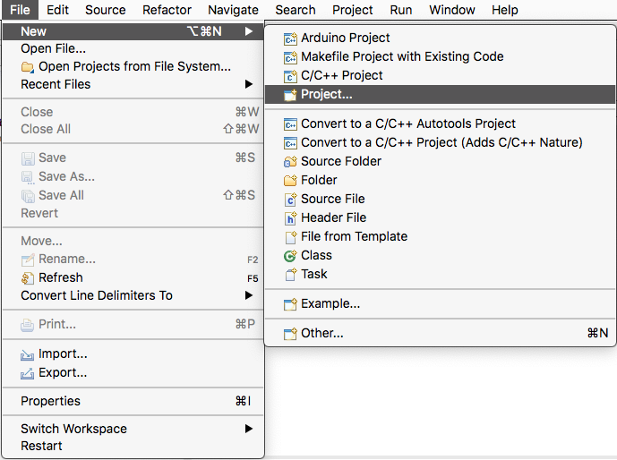
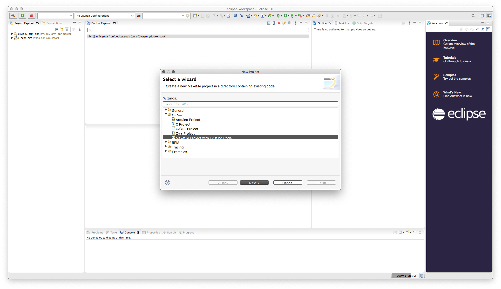
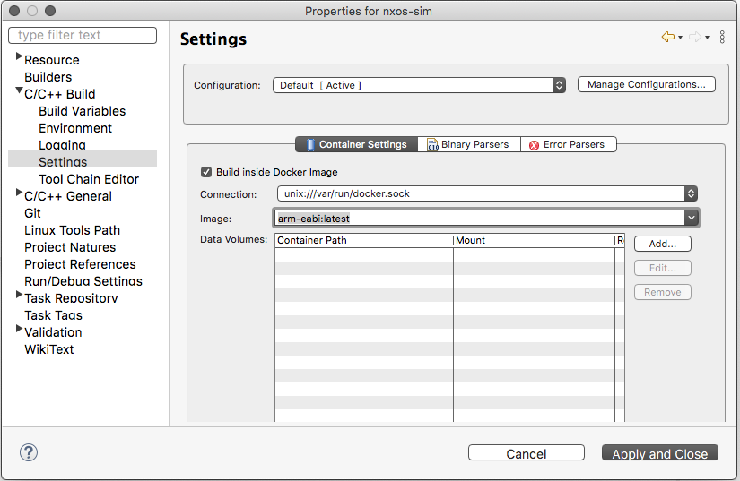
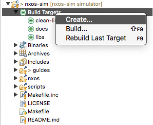
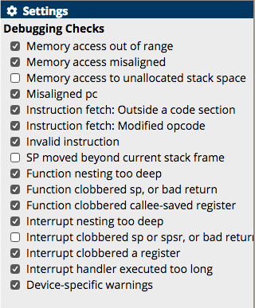

# Getting Started with NxOS-Sim
NxOS-sim can be built and run on various OS, due to the use of Docker to manage the build process, and a browser-based ARM simulator.
It has been tested on macOS Mojave (10.14.x), and will most likely work on other Linuxes.
It will probably work on recent Windows OS as well, but it has not been tested.

## System Requirements
- min dual-core x86 compatible CPU
- min 8 GB RAM (needed to run Docker instance, Eclipse and the browser)
- min 8 GB free HD space

## Set up Tools
- install [Docker](https://www.docker.com/)
- install [Eclipse CDT](https://www.eclipse.org/cdt/)
- install a compatible browser for [CPUlator](https://cpulator.01xz.net/doc/#requirements)

## Install Docker Image

This is best done via the terminal or shell.

- install arm-none-eabi docker image from [Docker Hub](https://hub.docker.com/r/tcwan/arm-none-eabi-gnutools)
(This is based on the official ARM gcc tools release)
```
$ docker pull tcwan/arm-none-eabi-gnutools
```

- tag docker image by listing the available images to get the <image_id>
```
$ docker images
$ docker tag <image_id> arm-eabi
```

- run Docker image as a standalone interactive shell in Linus/macOS (mapping current directory to /home)
```
$ docker run -it --rm arm-eabi -v$PWD:/home bash
[Inside Docker bash shell]
root@5c3ceeaae138:/work# ls /home
```

## Install Eclipse Plugins
- Install Eclipse Docker Tooling from Eclipse Marketplace

First open the Eclipse Marketplace Window in Eclipse CDT, then select Docker Tooling.


After Installation, add Docker Explorer View by going to "Window->Show View->Other..."


Select Docker Explorer View, and place it in a perspective pane.


# Building NxoS-sim applications

This can be done from the docker image bash shell prompt, or else you can define Build Targets in Eclipse and let Eclipse manage the build.

## Building NxoS-sim applications via command line

It is possible to build NxOS-sim using natively installed cross-compilation tools, but here we will use the Docker image for simplicity and consistency.

It is assumed that the Docker volume mounts have been setup properly, and you're in the nxos-sim directory.

See [docker run](https://linuxize.com/post/docker-run-command/) to understand how to setup the
volume parameter `-v`.
```
$ cd <nxos-sim dir>
$ docker run -it -v$PWD:/home --rm arm-eabi bash

[Insider docker image]
# cd /home
/home#
```

- Build the NxOS libraries
```
/home# make clean-libs
/home# make libs
```
- Build the application 
```
/home# make nxos/system/<app_name>
```
- Clean all applications (does not clean the libraries)
```
/home# make clean
```

- Clean all libraries (does not clean the projects)
```
/home# make clean-libs
```

## Building NxOS-sim applications via Eclipse

### Importing NxOS-sim into Eclipse workspace

First clone the NxOS-sim project to the local hard drive.

```
$ git clone https://github.com/tcwan/nxos-sim.git
```

Then import it into Eclipse using "File->New->Project..."



and select "New Makefile Project with Existing Code"



### Setup NxOS-sim to build with Docker

To build NxOS-sim applications using the Docker image, the Project setting must be updated.
Select the Project folder in the "Project Explorer", then choose the "Project->Properties" menu item.

In the Project Properties dialog, select "C/C++ Build->Settings", and click on the "Build Inside Docker Image" checkbox in the Container Settings tab (this should be visible if you've installed the Eclipse Docker Tooling plugin correctly).

Type the correct image name, either `arm-eabi` if you have tagged the docker image, or else `tcwan/arm-none-eabi-gnutools` for the full image name.




### Building the application

By default Eclipse has a "Project->Build Project" menu item or a Build button which you can select. This will cause the project to perform a build if possible. 

```
Note: Eclipse's "Project->Build Project" menu will execute the last build command
(initially it is `make all`). However, if you've executed "Project->Build Targets"
subsequently, "Project->Build Project" will not work as expected.
```

`make all` will try to build everthing in NxOS-sim. However, if you make any changes or updates to the library code after the most recent build, it will not always update the library archive (libnxos.a) correctly due to the complex dependency checking involved.

In addition, if you select "Project->Clean..." (`make clean`) Eclipse will only clean the applications in the nxos/systems directory. It will not clean the libraries.

In order to build and clean the libraries, you need to define Build Targets for the various Makefile options as listed in the command-line section.
- To build the all the applications, create a Build Target for `all`
- To build the libraries, create a Build Target for `libs`
- To clean the libraries, create a Build Target for `clean-libs`
- To build the documentation, create a Build Target for `docs`. The documentation will be rebuilt each time you make this target.

It is advisable to perform a `clean-libs` each time you modify a file inside the `nxos/base/` subdirectory. Building an application in `nxos/systems/` will automatically rebuild the libraries if they were cleaned previously.



You can also create a build target for a specific application instead of the default target `all`. The name of the build target should be: `nxos/systems/<app_name>`
# Running and Debugging NxOS-sim application

It is assumed that the build process for the application has completed successfully, and the `<app>.elf` executable file has been generated successfully.

## Launch CPUlator
- [CPUlator for Altera DE1-SoC](https://cpulator.01xz.net/?sys=arm-de1soc)


- Load the `<app>.elf` executable file from your PC. 
```
The built in CPUlator Editor and Assembler will not be used.
```
- Setup the Debugging Check Settings correctly for NxOS-Sim



## Running the NxOS-sim application

CPUlator acts like most GUI-based debugging environment. The difference is that virtual devices (based on the Altera DE1-SoC Development board) are also simulated and displayed on the screen.

The steps involved in running a NxOS-sim application are:
- Reload (Ctrl-Shift-L) the ELF file
- Restart (Ctrl-R)
- Setup Breakpoints (if any)
- Continue (F3) / Step Into (F2) OR Step Over (Ctrl-F2)/ Step Out (Shift-F2)
- Stop (F4) to force a breakpoint, and then continue execution via Continue or Step
- Switch between the Disassembly tab (Ctr-D) and the Memory tab (Ctrl-M) to inspect the system execution state
- Control the virtual devices using the Browser interface