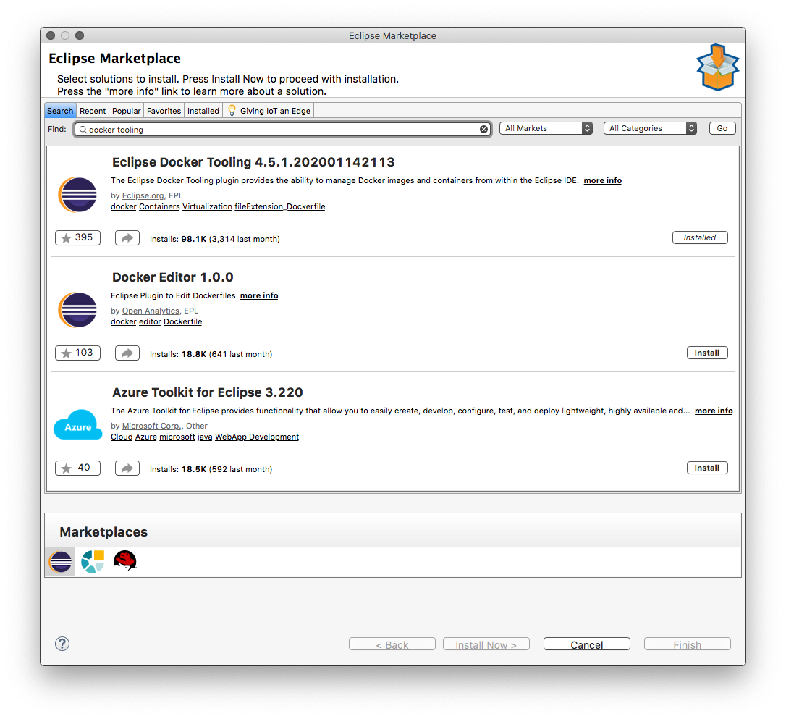
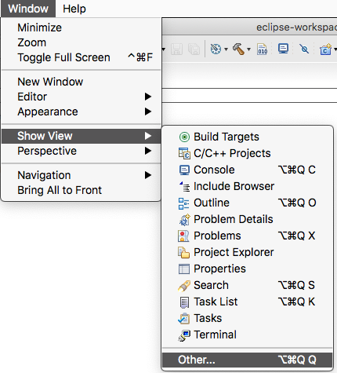
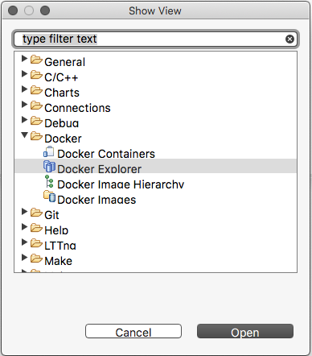
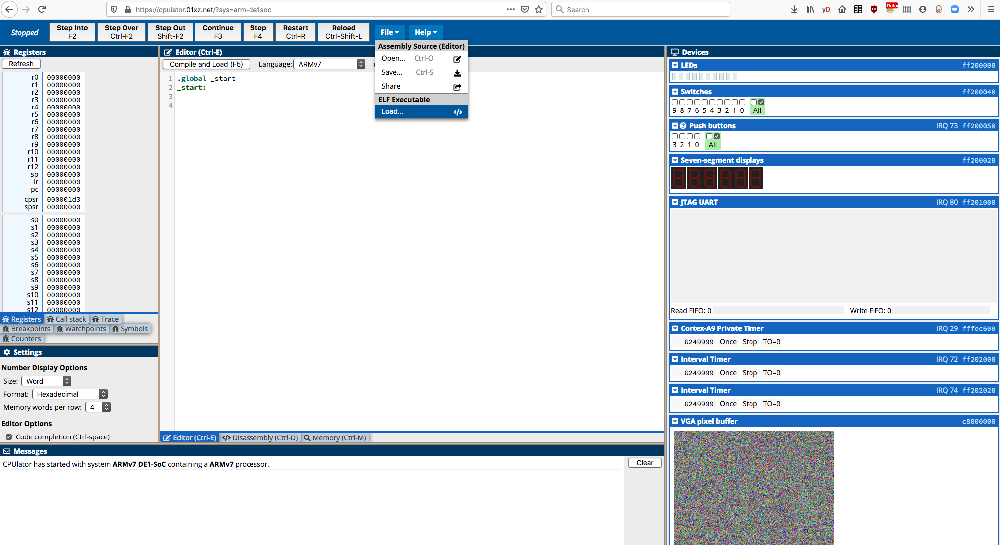

# Building NxOS-Sim Projects
NxOS-sim can be built on various OS, notably Linux, and macOS due to the use of Docker to manage the build prcess.
It will probably work on recent Windows OS as well, but it has not been tested.

## Setup Tools
- install [Docker](https://www.docker.com/)
- install [Eclipse CDT](https://www.eclipse.org/cdt/)

## Install Docker Image
- install arm-none-eabi docker image from [Docker Hub](https://hub.docker.com/r/tcwan/arm-none-eabi-gnutools)
(This is based on the official ARM gcc tools release)
```
$ docker pull tcwan/arm-none-eabi-gnutools
```

- tag docker image by listing the available images to get the <image_id>
```
$ docker images
$ docker tag <image_id> arm-eabi
```

- run Docker image as a standalone interactive shell in Linus/macOS (mapping current directory to /home)
```
$ docker run -it --rm arm-eabi -v$PWD:/home bash
[Inside Docker bash shell]
root@5c3ceeaae138:/work# ls /home
```

## Install Eclipse Plugins
- Install Eclipse Docker Tooling from Eclipse Marketplace

First open the Eclipse Marketplace Window in Eclipse CDT, then select Docker Tooling.



After Installation, add Docker Explorer View by going to "Window->Show View->Other..."



Select Docker Explorer View, and place it in a perspective pane.




# Building NxoS-sim projects

his can be done from the docker image bash shell prompt, or else you can define Build Targets in Eclipse and let Eclipse manage the build.

## Building nxos-sim projects via command line

It is assumed that the Docker volume mounts have been setup properly, and you're in the nxos-sim directory.

See [docker run](https://linuxize.com/post/docker-run-command/) to understand how to setup the
volume parameter `-v`

```
docker run -it -v$PWD:/home --rm arm-eabi bash
[Insider docker image]
# cd /home
/home#
```

- Build the NxOS libraries
```
/home# make clean-libs
/home# make libs
```
- Build the project 
```
/home# make nxos/system/<project_name>
```
- Clean all projects (does not clean the libraries)
```
/home# make clean
```

- Clean all libraries (does not clean the projects)
```
/home# make clean-libs
```

## Building nxos-sim projects via Eclipse

### Setup project to build with Docker


This will cause the project to perform a default build (`make all`) when the Eclipse build project option is selected.
However, it will not clean the libraries when you do a project clean (`make clean`).

Alternatively, define Build Targets for the various options listed in the command-line section.

# Running and Debugging NxOS-sim programs

## Launch CPUlator
- [CPUlator for Altera DE1-SoC](https://cpulator.01xz.net/?sys=arm-de1soc)



- Load the <program>.elf executable file from your PC.
- Setup the Debugging Check Settings correctly for NxOS-Sim


## Running the NxOS-sim program
- Reload (Ctrl-Shift-L) the ELF file
- Restart (Ctrl-R)
- Setup Breakpoints (if any)
- Continue (F3) / Step Into (F2) OR Step Over (Ctrl-F2)/ Step Out (Shift-F2)